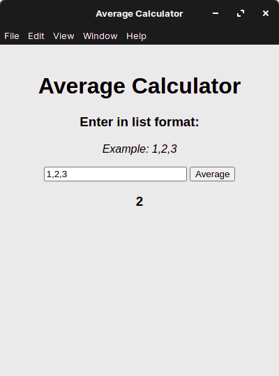

# average-calculator
 App with a GUI that calculates averages  
 [](https://forthebadge.com) [](https://forthebadge.com)  



## 💻 Installing
Heres some options:
### Windows
 - Coming soon
### Mac
 - Not coming soon unless I get an apple developer licence
### Linux
 - [AppImage](COMING VERY SOON)
 - the snap store maybe?

Requires a 64x/amd processor.

## 💾 Project Setup (for developers)
First, clone the project to disk with the GitHub CLI, GitHub Desktop, or however you get your git repos.  
In order to commit to the project or build the code, you will need the folowing installed:
 - [NodeJS](https://nodejs.dev)
 - [npm](https://npmjs.org)

Then run:
```bash
npm i
```

### Testing your changes
```bash
npm test
```
### Building
```bash
npm run build
```
This will output an AppImage and a snap file (for [snapcraft](https://snapcraft.io))

## 📜 Licencing
This project is licenced under the [GPL-V3.0](LICENCE)